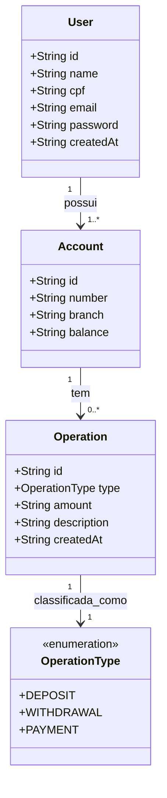

# Internet Banking Main API

Serviço principal da API bancária que gerencia autenticação de usuários, gerenciamento de contas e operações financeiras na arquitetura de microsserviços do Internet Banking.

## Funcionalidades

- **Gerenciamento de Usuários**: Registro e autenticação de usuários com JWT
- **Operações de Conta**: Consulta de saldo, depósitos, saques e pagamentos entre contas
- **Histórico de Transações**: Extrato completo da conta com histórico de operações
- **Notificações por Email**: Sistema de notificação assíncrona para todas as operações bancárias
- **Documentação da API**: Integração Swagger/OpenAPI para facilitar testes

## Diagrama de Relacionamento de Entidades



## Variáveis de Ambiente

### Perfil de Produção

- `DB_HOST` - Host do banco de dados (PostgreSQL)
- `DB_PORT` - Porta do banco de dados (padrão: 5432)
- `DB_NAME` - Nome do banco de dados
- `DB_USERNAME` - Nome de usuário do banco de dados
- `DB_PASSWORD` - Senha do banco de dados
- `SERVER_PORT` - Porta do servidor da API
- `JWT_SECRET` - Chave secreta para assinatura JWT
- `JWT_EXPIRATION` - Tempo de expiração do token JWT em milissegundos
- `EUREKA_SERVER_ADDRESS` - Host do servidor Eureka
- `EUREKA_SERVER_PORT` - Porta do servidor Eureka

### Perfil de Desenvolvimento (`dev`)

Usa valores codificados para desenvolvimento local:

- Banco de dados: `localhost:5432/internet_banking`
- Porta do servidor: `8081`
- Eureka: `localhost:8761`

## Configuração de Desenvolvimento Local

### Pré-requisitos

- Java 21+
- Maven 3.6+
- PostgreSQL 13+
- Eureka Server em execução

### Configuração do Banco de Dados com docker-compose

```bash
# A partir da raiz do projeto
docker compose up internet-banking-main-api
```

### Executando o Serviço

1. **Usando Maven (Perfil de Desenvolvimento)**:

```bash
cd internet-banking-main-api
./mvnw spring-boot:run -Dspring-boot.run.profiles=dev
```

### Documentação da API

- **Desenvolvimento**: <http://localhost:8081/swagger-ui.html>

### Principais Endpoints

- `POST /auth` - Autenticação de usuário
- `POST /users` - Registro de usuário
- `GET /accounts/balance` - Obter saldo da conta
- `POST /accounts/deposit` - Fazer depósito
- `POST /accounts/withdraw` - Fazer saque
- `POST /accounts/payment` - Transferir entre contas
- `GET /accounts/statement` - Obter histórico de transações

## Dependências de Serviços

- **internet-banking-eureka-server**: Descoberta de serviços
- **internet-banking-mail-service**: Notificações por email via cliente Feign
- **PostgreSQL**: Armazenamento de dados principal
